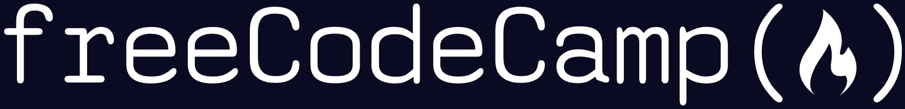

# FreeCodeCamp Full Stack Development Labs

This repository contains my solutions to various **FreeCodeCamp labs and projects** as I progress through the Full Stack Development curriculum.  
It’s organized by major sections of the course, with live demos available via **GitHub Pages**.

---

## 📂 Repository Structure
FreeCodeCamp-FullStack-Dev-Labs/
│
├── HTML-CSS/         # Completed HTML & CSS labs
│   ├── build-a-newspaper-article/
│   ├── build-a-page-of-playing-cards/
│   ├── build-a-product-landing-page/
│   ├── build-a-survey-form/
│   ├── build-a-technical-documentation-page/
│   ├── build-a-tribute-page/
│   ├── build-an-orbit-moon/
│   └── design-a-magazine-layout/
│
├── JavaScript/       # JavaScript labs (coming soon)
│
└── README.md         # This file

---

## 🌐 Live Demos (HTML & CSS Labs)

- [Build a Newspaper Article](https://nathanraym.github.io/FreeCodeCamp-FullStack-Dev-Labs/HTML-CSS/build-a-newspaper-article/)  
- [Build a Page of Playing Cards](https://nathanraym.github.io/FreeCodeCamp-FullStack-Dev-Labs/HTML-CSS/build-a-page-of-playing-cards/)  
- [Build a Product Landing Page](https://nathanraym.github.io/FreeCodeCamp-FullStack-Dev-Labs/HTML-CSS/build-a-product-landing-page/)  
- [Build a Survey Form](https://nathanraym.github.io/FreeCodeCamp-FullStack-Dev-Labs/HTML-CSS/build-a-survey-form/)  
- [Build a Technical Documentation Page](https://nathanraym.github.io/FreeCodeCamp-FullStack-Dev-Labs/HTML-CSS/build-a-technical-documentation-page/)  
- [Build a Tribute Page](https://nathanraym.github.io/FreeCodeCamp-FullStack-Dev-Labs/HTML-CSS/build-a-tribute-page/)  
- [Build an Orbit Moon](https://nathanraym.github.io/FreeCodeCamp-FullStack-Dev-Labs/HTML-CSS/build-an-orbit-moon/)  
- [Design a Magazine Layout](https://nathanraym.github.io/FreeCodeCamp-FullStack-Dev-Labs/HTML-CSS/design-a-magazine-layout/)  

---

## 🚀 Coming Soon

- JavaScript labs & projects  
- Responsive Web Design projects  
- Advanced front-end & back-end labs  

---

## 📖 About

I’m working through **FreeCodeCamp’s Full Stack Development path** and uploading my projects here as a way to track progress and share my work.  
